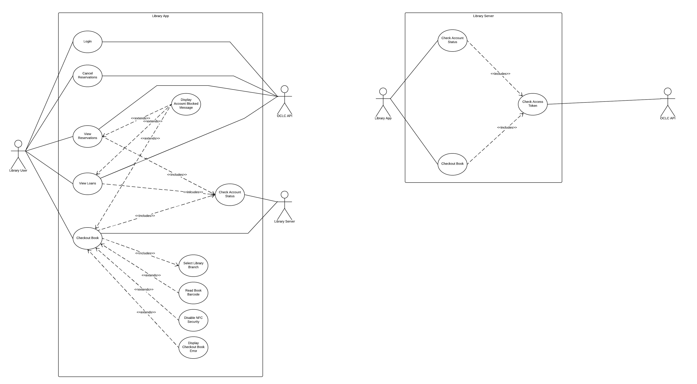

# Requirements

## Stakeholders

The key stakeholders in our project are:
- Students/Library Customers - They will be the main user of the application.
- Librarians - They will need to be able to assist users of the library, who will be using the application.
- Library service staff - They will be responsible for the distribution of the application.
- OCLC staff - They will be the provider of the majority of APIs required by the application, and resonsible for technical assistance.

## Use Case Diagram

## User Goal Flows

The key user goals of our app are to be able to login, checkout books and cancel reservations. Below we have designed the user flow:

### Login

* Basic Flow:
    * Open Application
    * Select UoB Login
    * Input email
    * Input password
    * Choose if you would like to remain logged in
    * Allow permission for the application to access your library account
    * Direct to app home page
* Alternative Flow:
    * When selecting UoB login, the user may choose to login as an External User
* Exceptional Flow:
    * The user decides to close the app part-way through logging in
    * The user loses internet connection while logging in.
    * User does not allow permissions

### Checkout Book

* Basic Flow:
    * Select library branch
    * Hold phone over RFID tag in book
    * Wait for checkout process to complete
    * Dismiss confirmation message
* Alternative Flow:
    * After scanning the RFID tag once, phone is moved away from book and looses connection to the RFID tag
    * Ask user to rescan the book, to disable the security
* Exceptional Flow:
    * User scans the book, removes before the checkout process is complete, then exits the app.
    * User scans a book that cannot be taken from library (reference book).

### Cancel Reservations

* Basic Flow:
    * Open reservation page
    * Select reservation
    * Select cancel reservation
* Exceptional Flow:
    * User has no internet connection, the user is then prompted to connect to the internet
    * The book is already cancelled, during which the flow will continue as if it succeeded

## Flow Decomposition

Decomposition of Checkout Book:

* Once the checkout process is started, the app should check the user library account status to ensure they are able to checkout a book.
* The user should select their library branch. This could be done automatically using geofencing.
* The user should then be asked to scan the RFID tag in the book.
* The application reads the barcode from the book.
* The application communiates with the OCLC WMS Platform to checkout the book.
* If the checkout is successful, then the books security status on the RFID tag should be turned off, so that alarms do not sound.
* The application should show a confirmation to inform the user the book has been checkout out.
* If the checkout is not successful, then inform the user of the reason for failure.

This docomposition leads to the following requirements for checking out a book

### Checkout Book

| Requirement | Importance | Planned Release | Notes |
| ----------- | ---------- | --------------- | ----- |
| Check if users account is blocked | Must | Final | - |
| Check if users account exceeds borrowing limit | Must | Final | - |
| Allow users to select library branch | Must | Beta | - |
| Automatically select library branch with geo-fencing | Could | - | Not added |
| Be able to check the security status of a book | Must | MVP |  To check if it is already checked out |
| Be able to read barcode from the RFID tag (ISO 15693) | Must | MVP | - |
| Be able to communicate with the OCLC WMS NCIP Staff Service to checkout the book | Must | Beta | Delayed until beta as new library system will not be active until after MVP release |
| Disable the security status of the RFID tag (ISO 15693) | Must | Beta | - |
| Give confirmation message when book is checkout out | Should | Beta | - |
| Confirmation message contains book title | Could | Final | - |
| If checkout fails display error message | Must | Final | - |

We have also followed this process, to create requirements for all other sections of the application:

### Home Page

| Requirement | Importance | Planned Release | Notes |
| ----------- | ---------- | --------------- | ----- |
| Check if users account is blocked | Should | Beta | - |
| Display a message if the user's account is blocked | Could | Final | - |
| Give the user an overview of their loans | Must | Beta | - |
| The overview of loans has the next book due back | Must | Beta | - |
| The overview of loans has the date the next book is due back | Must | Beta | - |
| The overview of loans shows how many books the user has checked out | Could | Beta | - |
| Give the user an overview of their reservations | Must | Beta | - |
| The overview of reservations shows the number of reservations the user has | Must | Beta | - |
| The overview of reservations shows the number of books ready for collection | Must | Beta | - |
| The overview of reservations shows the pickup location, if a book is ready for collection | Must | Beta | - |
| Allow the user to refresh the data | Must | Beta | - |
| Automatically refresh the data, if it is older than 10 minutes | Could | Beta | - |

### Loans

| Requirement | Importance | Planned Release | Notes |
| ----------- | ---------- | --------------- | ----- |
| Show the user a list of their loans | Must | MVP | Will fill with example data in MVP, in beta will use live data |
| Communicate with OCLC WMS NCIP Patron service to get the users loans | Must | Beta | Delayed until beta as new library system will not be active until after MVP release |
| For each loan in the list, display the title of the book | Must | MVP | - |
| For each loan in the list, display the author of the book | Must | MVP | - |
| Display the number of days until the book is due back | Must | MVP | - |
| Inform the user that the book will auto-renew | Should | Beta | Not fulfilled, after attempting in beta. The API did not have the data needed |
| Display extra detail about the loan if its clicked | Should | Beta | - |
| Be able to sort loans alphabetically | Could | Beta | - |
| Be able to sort loans by due date | Should | Beta | - |
| Allow the user to refresh the data | Must | Beta | - |
| Automatically refresh the data if it is older than 10 minutes | Could | Beta | - |

### Reservations

| Requirement | Importance | Planned Release | Notes |
| ----------- | ---------- | --------------- | ----- |
| Show the user a list of their reservations | Must | MVP | Will fill will example data in MVP, in beta will use live data |
| Communicate with OCLC WMS NCIP Patron service to get the users reservations | Must | Beta | Delayed until beta as new library system will not be active until after MVP release |
| Books are sorted, with ones ready to collect at the top of the list | Must | MVP | - |
| For each reservation show the title of the book | Must | MVP | - |
| For each reservation show the author of the book | Must | MVP | - |
| If books are ready to collect, show their pickup location | Must | Beta | - | 
| If books are not ready to collect, show the position of the user in the queue | Must | Beta | - |
| Display extra detail about the reservation if it is clicked | Should | Beta | - |
| Be able to cancel reservations | Could | Beta | - |
| Be able to make reservations | Could | - | Not added |

### Sign In

| Requirement | Importance | Planned Release | Notes |
| ----------- | ---------- | --------------- | ----- |
| Allow University of Bristol users to login to the app with the universities Single Sign On | Must | Beta | Added using OCLC OAuth, which uses SSO |
| Allow external users to login to the app | Could | Beta | Was provided by using OCLC OAuth |

### Menu

| Requirement | Importance | Planned Release | Notes |
| ----------- | ---------- | --------------- | ----- |
| Display the users name | Should | Beta | - |
| Display the users login email | Could | Beta | - |
| Has a button to the checkout book section | Must | MVP | - |
| Has a button to the homepage | Must | Beta | Added when dashboard is created |
| Has a button to display the users loans | Must | MVP | - | 
| Has a button to display the users reservations | Must | MVP | - |

# Non-Functional Requirements

- A library admin (with no programming experience) must be able to add a new library branch to the app in under 5 minutes.
- It must be possible to know how to checkout a book using the app after a 5 minute introduction.
- The server must be able to handle 1 checkout per second.
- Requests for the same data from OCLC must not be made within 1 minute of each other, to reduce load.
- The app must be able to checkout books, 100% of the time that the OCLC system is working.
- The app must have access to only the authenticated user's details.
- The app must work with any phone running android version > 7.0
