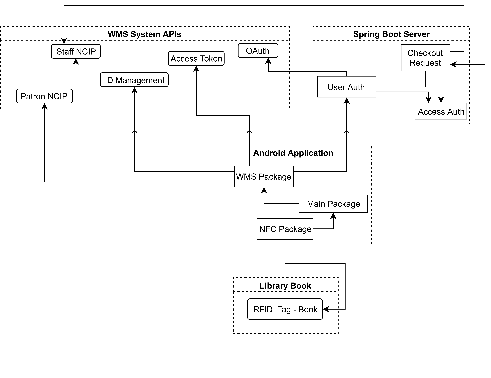
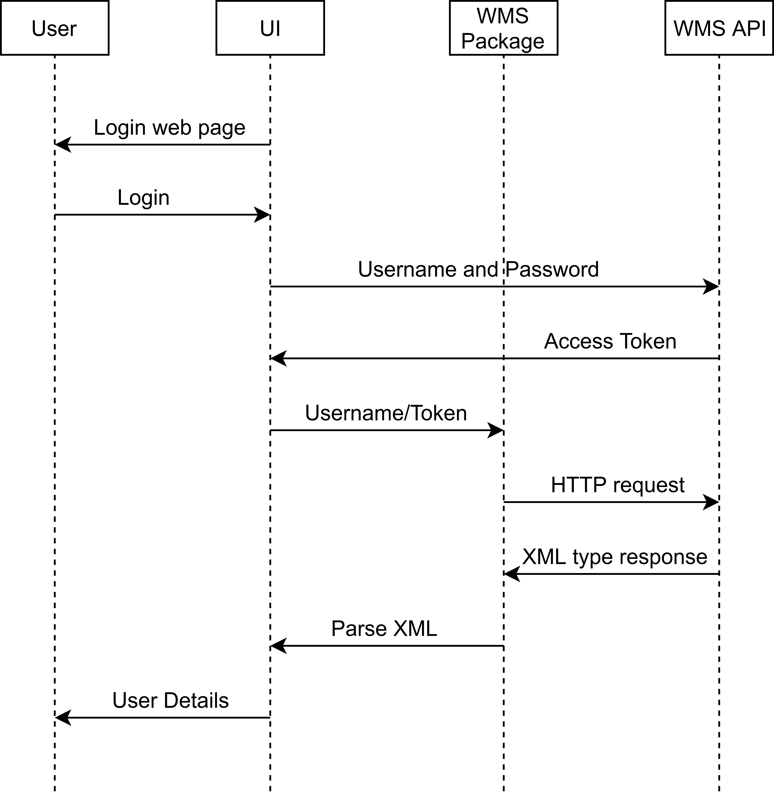
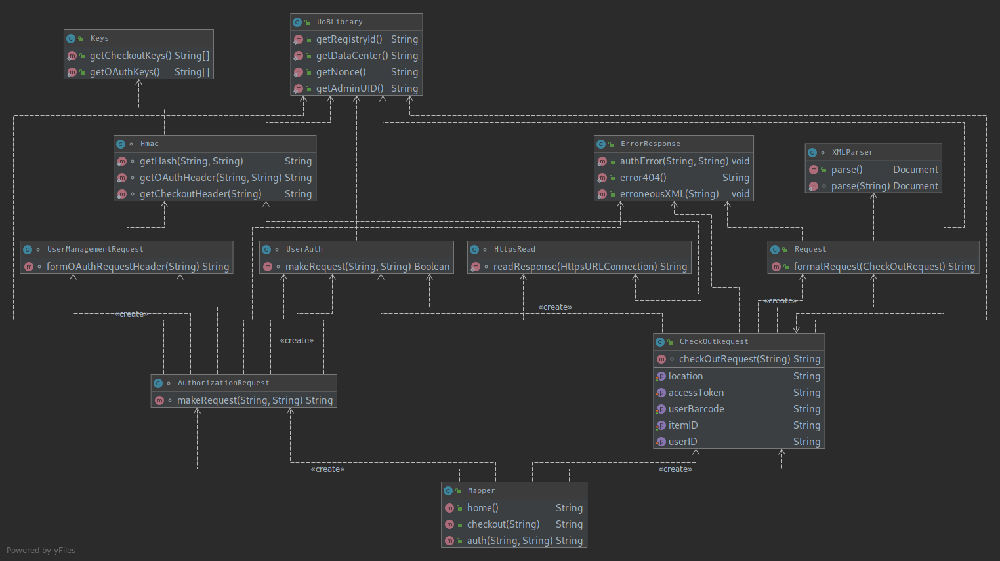

# Overview

**Client:** University of Bristol Library Services.

The client predominantly provides access to a large number print materials (such of books and digital content) to the existing 18000+ University of Bristol members. Graduates, former staff, members of local societies as well as members of universities in the UK & Ireland part of the SCONUL Access Scheme can also apply for memberships and become members but these are subject to individual review. There is also visitor passes available however print materials cannot be issued to such members.

As part of a new upgrade going live in January 2019, the client will be upgrading their library management system to a new cloud based setup hosted by OCLC, called WMS. In addition to these upgrades, the client would like us to develop a mobile application for their existing members to self-issue print materials. This would negate the need for existing members to use a librarian or the self service machines to take out materials as they would now be able to do this on the fly, with their phones.

We plan to use the existing RFID tags present in the print materials with the existing NFC mobile phone technologies in order to fulfill this criteria. Our vision is, staff and students of the University of Bristol will be able to login to our app via their existing UoB Single Sign On Service, press scan, tap the book they require and walk out of the library. All of the work related to the NFC Capability and the RFID Capability will be encapsulated away from the user leaving them with a perfectly functional, beautiful app.

Alongside issuing print materials to themselves, it is envisioned the application will provide reminders, in app, which will allow the user to be alerted of over-due books. These new notifications would be in addition to the current system, which is all currently done via email. This current method is not very efficient, as not every user is proactive in checking their emails but, with this new proposed design, users will be alerted on their mobile phone, when the app is opened.
# Requirements

## Stakeholders

The key stakeholders in our project are:
- Students/Library Customers - They will be the main user of the application.
- Librarians - They will need to be able to assist users of the library, who will be using the application.
- Library service staff - They will be responsible for the distribution of the application.
- OCLC staff - They will be the provider of the majority of APIs required by the application, and resonsible for technical assistance.

## Use Case Diagram

## User Goal Flows

The key user goals of our app are to be able to login, checkout books and cancel reservations. Below we have designed the user flow:

### Login

* Basic Flow:
    * Open Application
    * Select UoB Login
    * Input email
    * Input password
    * Choose if you would like to remain logged in
    * Allow permission for the application to access your library account
    * Direct to app home page
* Alternative Flow:
    * When selecting UoB login, the user may choose to login as an External User
* Exceptional Flow:
    * The user decides to close the app part-way through logging in
    * The user loses internet connection while logging in.
    * User does not allow permissions

### Checkout Book

* Basic Flow:
    * Select library branch
    * Hold phone over RFID tag in book
    * Wait for checkout process to complete
    * Dismiss confirmation message
* Alternative Flow:
    * After scanning the RFID tag once, phone is moved away from book and looses connection to the RFID tag
    * Ask user to rescan the book, to disable the security
* Exceptional Flow:
    * User scans the book, removes before the checkout process is complete, then exits the app.
    * User scans a book that cannot be taken from library (reference book).

### Cancel Reservations

* Basic Flow:
    * Open reservation page
    * Select reservation
    * Select cancel reservation
* Exceptional Flow:
    * User has no internet connection, the user is then prompted to connect to the internet
    * The book is already cancelled, during which the flow will continue as if it succeeded

## Flow Decomposition

Decomposition of Checkout Book:

* Once the checkout process is started, the app should check the user library account status to ensure they are able to checkout a book.
* The user should select their library branch. This could be done automatically using geofencing.
* The user should then be asked to scan the RFID tag in the book.
* The application reads the barcode from the book.
* The application communiates with the OCLC WMS Platform to checkout the book.
* If the checkout is successful, then the books security status on the RFID tag should be turned off, so that alarms do not sound.
* The application should show a confirmation to inform the user the book has been checkout out.
* If the checkout is not successful, then inform the user of the reason for failure.

This decomposition leads to the following requirements for checking out a book

### Checkout Book

| Requirement | Importance | Planned Release | Notes |
| ----------- | ---------- | --------------- | ----- |
| Check if users account is blocked | Must | Final | - |
| Check if users account exceeds borrowing limit | Must | Final | - |
| Allow users to select library branch | Must | Beta | - |
| Automatically select library branch with geo-fencing | Could | - | Not added |
| Be able to check the security status of a book | Must | MVP |  To check if it is already checked out |
| Be able to read barcode from the RFID tag (ISO 15693) | Must | MVP | - |
| Be able to communicate with the OCLC WMS NCIP Staff Service to checkout the book | Must | Beta | Delayed until beta as new library system will not be active until after MVP release |
| Disable the security status of the RFID tag (ISO 15693) | Must | Beta | - |
| Give confirmation message when book is checked out | Should | Beta | - |
| Confirmation message contains book title | Could | Final | - |
| If checkout fails, display error message | Must | Final | - |

We applied the same process for requirements in all other sections of the application:

### Home Page

| Requirement | Importance | Planned Release | Notes |
| ----------- | ---------- | --------------- | ----- |
| Check if users account is blocked | Should | Beta | - |
| Display a message if the user's account is blocked | Could | Final | - |
| Give the user an overview of their loans | Must | Beta | - |
| The loans overview contains the next book due back | Must | Beta | - |
| The loans overview contains the date the next book is due | Must | Beta | - |
| The loans overview contains the number of books the user has checked out | Could | Beta | - |
| Give the user an overview of their reservations | Must | Beta | - |
| The reservations overview shows the number of reservations the user currently has | Must | Beta | - |
| The reservations overview shows the number of books ready for collection | Must | Beta | - |
| The reservations overview shows the pickup location if a book is ready for collection | Must | Beta | - |
| Allow the user to refresh the data | Must | Beta | - |
| Automatically refresh the data, if older than 10 minutes | Could | Beta | - |

### Loans

| Requirement | Importance | Planned Release | Notes |
| ----------- | ---------- | --------------- | ----- |
| Show the user a list of their loans | Must | MVP | Will fill with example data in MVP, in beta will use live data |
| Communicate with OCLC WMS NCIP Patron service to get the users loans | Must | Beta | Delayed until beta as new library system will not be active until after MVP release |
| For each loan in the list, display the title of the book | Must | MVP | - |
| For each loan in the list, display the author of the book | Must | MVP | - |
| Display the number of days until the book is due back | Must | MVP | - |
| Inform the user that the book will auto-renew | Should | Beta | Not fulfilled, after attempting in beta. The API did not have the data needed |
| Display extra detail about the loan, if clicked | Should | Beta | - |
| Be able to sort loans alphabetically | Could | Beta | - |
| Be able to sort loans by due date | Should | Beta | - |
| Allow the user to refresh the data | Must | Beta | - |
| Automatically refresh the data, if older than 10 minutes | Could | Beta | - |

### Reservations

| Requirement | Importance | Planned Release | Notes |
| ----------- | ---------- | --------------- | ----- |
| Show the user a list of their reservations | Must | MVP | Will fill will example data in MVP, in beta will use live data |
| Communicate with OCLC WMS NCIP Patron service to get the users reservations | Must | Beta | Delayed until beta as new library system will not be active until after MVP release |
| Books are sorted, with ones ready to collect at the top of the list | Must | MVP | - |
| For each reservation, show the title of the book | Must | MVP | - |
| For each reservation, show the author of the book | Must | MVP | - |
| If books are ready to collect, show their pickup location | Must | Beta | - | 
| If books are not ready to collect, show the position of the user in the queue | Must | Beta | - |
| Display extra detail about the reservation if clicked | Should | Beta | - |
| Be able to cancel reservations | Could | Beta | - |
| Be able to make reservations | Could | - | Not added |

### Sign In

| Requirement | Importance | Planned Release | Notes |
| ----------- | ---------- | --------------- | ----- |
| Allow University of Bristol users to login to the app with the universities Single Sign On | Must | Beta | Added using OCLC OAuth, which uses SSO |
| Allow external users to login to the app | Could | Beta | Was provided by using OCLC OAuth |

### Menu

| Requirement | Importance | Planned Release | Notes |
| ----------- | ---------- | --------------- | ----- |
| Display the users name | Should | Beta | - |
| Display the users login email | Could | Beta | - |
| Has a button re-directing to the checkout book page | Must | MVP | - |
| Has a button to the homepage | Must | Beta | Added when dashboard is created |
| Has a button to display the users loans | Must | MVP | - | 
| Has a button to display the users reservations | Must | MVP | - |

# Non-Functional Requirements

- A library admin (with no programming experience) must be able to add a new library branch to the app in under 5 minutes.
- It must be possible to know how to checkout a book using the app after a 5 minute introduction.
- The server must be able to handle 1 checkout per second.
- Requests for the same data from OCLC must not be made within 1 minute of each other, to reduce load.
- The app must be able to checkout books, 100% of the time that the OCLC system is working.
- The app must have access to only the authenticated user's details.
- The app must work with any phone running android version > 7.0
## High level Achitecture

The above picture provides an overview to the four main parts of the system. The WorldShare Management Services (WMS) APIs and Library Book systems are already in place and are to be used by us to create the system meanwhile the Android Application and the Spring Boot Server (will be referred to as the server from now on in this document) are both parts of the system, which we will create.

The server will be an API for the Android Application, effectively acting a wrapper to make requests that a standard user cannot make, an example being checking out a book, something which requires access to private keys that for security, cannot be stored on a user's device.   

The Android Application is the way users will interact with our system. It will provide a method for scanning the RFID tags in the library books and a method for checking them out. There will be three main packages: NFC, WMS and a main package. Together, they will handle communicating with the RFID tag in the book, communicating with the WMS System API and handling the UI respectively.  

## External Systems  

The two main external systems that our app and server will interact with are the RFID tag, found in the library books, and WMS.  

The RFID tags follow the ISO 15693 standard and use the NfcV class in the Android SDK. These tags contain the ID of the book they are applied to and they also contain a byte which states whether this book is currently checked in to the library or not. We first read the ID from the tag and start the checkout process, if the checkout process is successful, we change that special security byte on the tag to checked out so it does not trigger the library security alarms.

WMS has a series of APIs that use standard HTTP/S methods to invoke, these APIs will be used for login, book check-out and getting user details.

## Dynamic UML

This sequence diagram details the flow of data when a user logs in to the app as the data is passed around different parts of the system. The server is not used in this particular flow. When the app is loaded for a new user a web view of the login website will be loaded for the user to enter the username and password. The application never reads the username and password it just gets sent straight to WMS and the app records the access token granted to it. It then uses this access token to make further requests. When logging in, it will then use this access token to get details about the user, most notably what books they have checked out and reserved books. This is done by making a request to the WMS API for that data and parsing the response (usually in XML form, however some will be JSON) and then inserting the relevant data into the UI to display to the user.  

## Static UML

This UML diagram details the layout and dependencies of the server. It gives a basic design as to what (non private) methods the different classes should have and where dependencies should link classes. It splits the classes into the two main tasks that the server will carry out: checkout and user authorisation requests. The two tasks have distinct purposes, but share classes and the diagram shows which classes need to be shared in a simplified way. It also splits the classes up into different logical layers, with each layer acting almost as an abstraction of the layer below it. This provides simpler method writing for layer above, which means it can cover a broad area of the task. It also showed details on how information about the university library will be shared around the different classes in the form of public access classes which store the data to be accessed from anywhere in the program.  

# Development Testing

## Job Intent Services

We will use three different JobIntentServices, WMSNCIPService, AuthService and IMService. All of these services make api requests to either our server, or three different OCLC APIs. Collectively, they are responsible for obtaining all the data required by the application to function. Therefore, we must ensure that these services are tested rigorously, to ensure the app is able remains functioning. Although we are not able to mock these external APIs, we are able to create Request objects and then ensure that the requests made have the correct format and adhere to the correct set of rules outlines by the API provider (either ourselves or OCLC).

If the service is making a request to the server we would outline how data will be sent with the request and in what format, as well as, HTTP methods and any headers that are required. Once we have agreed the protcol required for communicating to the server we could then create a set of tests that would ensure any request we made adhered to this pre-set protocol, by doing this it would allow us to ensure the API Request created in the service would be as expected when it reached our server. We carried out a similar process when creating requests that would be made to the OCLC WMS API, inspecting their documentation, we were able to create some tests to ensure that any request made would be in the correct format with the correct data. By following this approach we were able to ensure that the API requests were of the correct specification for the API.

We will use JUnit for the testing of the requests, this will be supplemented by manual testing of the actual service, for reasons detailed below.

### Challenges

There were a few challenges the we faced when testing the Job Intent Services. Firstly, it is not possible to test an intent service directly, this point is made clear on the Android documentation. However, there is also a method provided to help overcome this limitation. We had to split the logic aspects of the service from the service into a separate testable class, and then call the logic from inside the service. This poses a challenge as we needed to decide how much logic we wanted to extract from the service and how much should be kept inside. We decided that a good split would be to have classes that generated the requests needed by the service and the service was responsible to for adding those requests to the request queue for them to be actioned on. This meant we were able to test each request independently, whilst also keeping the service in control of what is executed. 

Secondly, we also faced issues working with the APIs themselves, since there was no sandbox environment, for us to test how to use the api before it was implemented. This meant that we had to be careful, when making requests to ensure that we kept track of what we did, so that it could be undone if it needed to be.

## NFC Scanning

We initialled attempted to contact Bibliotheca for assistance with reading the tags, however after turning a blank, we had to workout how the data on the tags was encoded. This had many challenges, one of the key challenges was testing that any method for decoding the data on the tag had to be tested thoroughly. After working out how the data was encoded, we created tests with the example data we had accumulated from the manual decoding. These tests coud then be used as a basis for ensuring that our implementation of any decoding algorithm was correct.

### Challenges

Challenges related to RFID scanning were significant. It couldn't be tested using a JDK method and there did exist a method to create a mock tag within the Android OS, however documentation on it was sparse. This lead us to using actual library books to test, using logs to manually make sure the data was being parsed correctly and the returned barcode was the same as printed in the book. For security, we observed what the difference for a book was when checking it in and out using the self service machines. We found that the AFI byte in the tag was changed and on one value the alarm went off and on the other it didn't. So we wrote to the tag from the phone such that it didn't set off the alarm, that would have been inconvenient for our users.

## Server
Main job was to take requests from phone and wrap with extra permissions. The majority of the testing will take place on the application. This means that we only need to check it executes requests correctly. If request is misformed its the applications fault. Unit Tests can be used to test key components such as generating headers, but not everything. The API will be tested using the online API service OCLC provides to work out how it works and what is need. This is then implemented in Java for the server. Before deployment the server is tested locally using cURL to simulate requests from the application and observing the results and adjusting where necessary.  

### Challenges

The server interacted with a live system that the library uses so we couldn't make too many requests to check out books. We had to control the checking in and out of specific books as to not inflict upon actual library users, we didn't have a sandpit to test. This meant unit tests to be run at each update would have not worked as it is not separate from the outside world and therefore API calls wouldn't always get the same results. So we will test only when changed, make sure it works, and then leave it. 

# Continuous Integration

In our project, we opted to use Circle CI to allow for continuous testing of each commit made. This ensured that if a new commit failed some tests, it was noticed and informed us through a notification in our team chat on Slack. We also used Circle CI to manage our deployment. This meant that the application would only be deployed if all the tests were successful. For our releases, we have a system where tagging a commit with a version number would trigger a release to be created, with a release being added to GitHub with an apk added as an asset.

We also used a tool called Codacy. This tool analysed our code to ensure that the code we wrote was formatted correctly and up to a good standard. It was setup to check each pull request, this meant that when we merged our branches back into master, all our code was reviewed automatically. If Codacy found flaws in our code, such as inconsistent function/class naming or unused imports, it would comment on the pull request to inform us that the code was not up to standards and would detail what needs to be changed. Using this tool helped us to keep our code consistent among the team, whilst also making sure we did not write anything that would be error prone. 

# Release Testing

Throughout development, our testing aimed to target everything the end-user will interact with, which included consideration for normal, alternative and exception flows.

Every release is tested with its own set of tests and every previous releases' tests where applicable.

*eg: release 1.0.2 was tested with all the tests from 1.0.2, all the tests from release 1.0.0 and all the tests from release 1.0.1.*

#### Release 1.0.0

1. Menu button opens menu.
1. Menu button closes menu.
1. Scrolling works on the Loans Fragment 
1. Scrolling works on the Reservations Fragment
1. Scroll position is kept even when swiping across fragments.

#### Release 1.0.1

1. Check Application Icon displays correctly on the homescreen.
1. Check Username displays correctly on the sidebar. 
    - on 1multiple screen sizes.
    - on names exceeding bounds of the sidebar. [eg. Anastasia Abategiovanni Junior]
1. Check Loan/Reservation/Overdue status displays correctly within each loan container.

#### Release 1.0.2

1. Correct option showing the current page is shown on the sidebar.
1. Display the correct barcode when a book is scanned.
1. Display the security byte when a book is scanned.

#### Release 1.0.3
1. Check the confirm pages opens when a book is scanned.
1. Check application splash-screen displays correctly
    - on 1multiple screen sizes.
    - in portrait mode.
    - splash-screen remains in portrait mode even if the phone is in landscape mode.
1. Check sample login page displays correctly
    - on 1multiple screen sizes.
    - in Landscape & Portrait modes.

#### Release 1.0.4
1. Check *"No Loans"* is displayed in the centre of the page when there are no loans 
    - in Landscape & Portrait modes.
1. Check *"No Reservations"* is displayed in the centre of the page when there are no reservations.
    - in Landscape & Portrait modes.

#### Release 1.0.5 - Implemented Live Loans & Reservations
1. Check to see whether their live loans are shown to the user.
1. Check to see whether their live reservations are shown to the user.
1. Check pressing an active loan opens a dialog showing the book, publisher and date due back.

#### Release 1.0.6
1. Swipe to refresh refreshes the page
    - opening the app in the loans page and checking out a book at the library. The book should appear after swiping to refresh.
1. Security tag is disabled when a book is scanned through the app.

#### Release 1.0.7
1. Dashboard is shown when the user opens the app.
1. Pressing the loans cardview in dashboard redirects to the loans fragment.
1. Pressing the reservations cardview in dashboard redirects to the reservations fragment.

#### Release 1.0.8: Implemented Single Sign-On login
1. The different sorting functions correctly sort the list of loans.
1. Sorting is kept in place when a refresh occurs and a new book is added.
1. Pressing the back button twice in the dashboard will exit the app.
1. Pressing the back button during the login process with return to the start of the login.

#### Release 1.0.9
1. Automatic update is triggered in 10 minute intervals.
1. Dashboard displays the correct number of days remaining of the nearest book due.
1. Dashboard displays the correct of maximum number of books the user can checkout.

#### Release 1.1.0
1. NFC fragment does not open if the user does not have NFC.
1. NFC fragment does not open when user is not connected to the internet.
1. NFC fragment redirects to the NFC Settings if the user has NFC disabled.
1. NFC fragment redirects to the Network Settings if the user is not connected to the internet.
1. NFC fragment does not open when the user is connected to a network but not to the internet.

#### Release 1.1.1
1. Scanning 'confined to library' material will fail checkout.
1. Scanning 'confined to library' material will not disable security.
1. User denying access to NCIP Service after login will output a message stating access is required.
1. Denying access to NCIP 3 times redirects to the start of the login process.

#### Release 2.0.0: Implemented Live Checkout
1. Logout redirects to the login and removes previous users data.
1. Scanning a book will wait for confirmation from the API before disabling the security tag.
1. Live checkout implemented, if a book scan is successful, the book security is disabled.

#### Release 2.0.1
1. If a loan is due today, the loans container will say due today.
1. If a loan is due tomorrow, the loans container will say due tomorrow.

11280x720, 1920x1080, 800x480, 854x480, 960x540, 1024x600, 1280x800, 2560x1440, 480x320, 1920x1200 and 1024x768. According to Unity3D [2017], these resolutions combined are responsible for 97.2% of all android devices.
# Evaluation

For evaluation, we put our app to the test in the real world. We interviewed some frequent library users around the campus and gave them brief access to the app. We define frequent users as those who use the library more than twice a week and are already familiar with the current library checkout system. The tests took place in mixed locations such as libraries and study centres. 

As every student using the library has very similar goals, whether this be reading material in the library or taking materials away, we treated those interviewees as a representative sample. 1-in-6 of those students received a questionnaire where we asked for feedback on the navigation, feel and functionality of our product.

Each tester was given approximately 10 minutes of time and a list of tasks to complete such as logging in and out, check the current loans and reservations on their accounts, cancelling a reservation as well as checking out a book. We insisted on giving testers as little hint or guidance as possible in terms of navigation so we could study the intuition of our application.

For our purposes, written questionnaires wouldn't have provided us with as much feeling for how the users found the usage of the application. So we conducted informal interviews as it allowed us to ask testers for feedback and apply that feedback immediately, with follow up questions or extra hints.

## Interviews & Observations

We used release 1.0.6 and told thirty users, "This is a beta version of the new app we are developing for the UoB libraries" and gave them two tasks to complete so we could watch their interaction with our system. Task one asked the user to checkout a new book using the app and task two asked users to look around the app and tell us what functionality they could see the applications offers them.

From our observations, we found users were expecting to be able to click the cardviews in the dashboard. In the next release, 1.0.7, pressing the cardviews on the dashboard page redirected the user to the corresponding loans and reservations fragment. Additionally, three-in-five users seemed unclear on the functionality of the floating action which led us to change its icon from a camera icon to a customised NFC icon which had more familiarity of that of a book. 

Furthermore, all users had difficulty understanding how to checkout a new book once they located the *"Scan a new book"* page. This led us to adding a *"Show me how"* button at the end of the page which would display the instruction only when requested. This helped remedy the problem however when we re-sampled this change, a significant three-in-five users were still confused. Some users would use the phone as a barcode reader, some users as a camera and one user even put the book over the phone thinking it would pick up the weight of the book before actually reading the instructions.

We went away and created a powerful visual cue which replaced the un-necessary NFC logo and the *"Show me how"* button in the *"Scan a new book"* page by means of a two-stage animation. The first stage shows a book being open on the last page with the RFID tag and the second stage showing a phone being held over the tag. This animation was better able to deliver the message as the third sample of users had no difficulties checking out a new book. 

To conclude, through the use of interviews, we ensured our product meets every expectation of the end-user and rather than guessing, we delivered what was required.

## Results  

Results can be found here: https://github.com/josh26turner/UoB-Library-App/tree/master/docs/Testing/Testing%20Round%201
